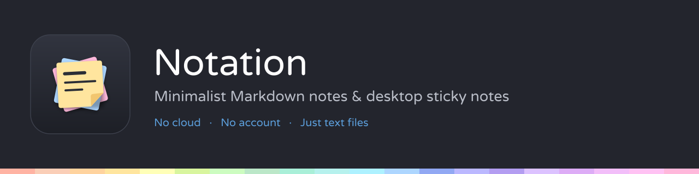

<p align="center">
  
</p>

<p align="center">
  <b>Your notes, live-rendered as you type — and pinned to your desktop as sticky notes.</b><br>
  A minimalist local-first Markdown editor with workspaces, tabs and post-its.
</p>

<p align="center">
  <i>No cloud. No account. Just text files.</i>
</p>

---

## Why Notation

Most note apps want your notes in their database and their cloud. Notation doesn't.
Every note is just a **`.md` file in a folder you control** — readable, diff-able, and
yours. Point Notation at any folder (a Syncthing share, a NAS, a plain directory) and
it becomes a workspace in the sidebar. Edit in Notation or in any other editor; it's
just text.

## Live Markdown editing

Type Markdown, see the document — the line you're editing shows its raw source, every
other line renders in place (the Typora style):

- **Headings, lists, quotes, task lists** — interactive checkboxes included.
- **Tables** edited cell-by-cell, in place; Tab/Enter navigation, rows and columns
  grow as you type.
- **Fenced code blocks** with syntax-aware editing, **math** via KaTeX
  (`$inline$` and `$$block$$`), and **Mermaid gantt** blocks rendered as charts.
- Smart typing: auto-continued lists, auto-closed fences, link pasting, and
  click-to-follow links (notes link to notes).
- **Export any note to PDF.**

## Desktop sticky notes

The third window button folds any note into a small **always-on-top post-it**:

- Pick a pastel per note; **colour and size are remembered** for that file.
- Edit right on the post-it — it's the same live editor, autosaving to the same file.
- Right-click a tab → **Move to sticky note** to peel it off into a post-it, or
  **Gather all windows and stickies** to pull everything back into one window.
- Stickies survive a restart: the session restores them where you left them.

## Workspaces, tabs & windows

- A **workspace** is just a folder; the sidebar tree updates **live** when files
  change on disk (create, delete or rename in your file manager and it shows up).
- Tabs, drag-to-reorder, drag a tab **between windows** or drop it on the desktop to
  detach; external edits to open notes reload automatically.
- Sessions persist — windows, tabs, stickies, geometry.

## Install

Download an installer from the [latest release](https://github.com/lhdharris/notation-app/releases/latest):

| Platform | File |
|---|---|
| Fedora / RHEL / openSUSE | `notation-app-<version>.x86_64.rpm` — `sudo rpm -i …` |
| Debian / Ubuntu | `notation-app_<version>_amd64.deb` — `sudo dpkg -i …` |
| macOS | `Notation-<version>.dmg` *(build from source — config included)* |
| Windows | `Notation Setup <version>.exe` *(build from source — config included)* |

> Builds are **unsigned**. macOS: right-click the app → **Open** (or
> `xattr -dr com.apple.quarantine /Applications/Notation.app`). Windows SmartScreen:
> **More info → Run anyway**.

## Run from source

```bash
cd electron-app
npm install
npm start
```

## Building installers

All targets are driven by `electron-builder`; run them from `electron-app/`. Each
installer must be built **on (or for) its own OS**:

```bash
# Linux (on Linux — needs rpmbuild for rpm, dpkg + fakeroot for deb)
npm run dist        # .rpm  (Fedora/RHEL/openSUSE)
npm run dist:deb    # .deb  (Debian/Ubuntu)

# macOS / Windows (on a Mac)
export CSC_IDENTITY_AUTO_DISCOVERY=false   # unsigned builds
npm run dist:mac    # .dmg  (host architecture)
npm run dist:win    # .exe  (NSIS; needs Wine on macOS)
npm run dist:all-on-mac   # dmg + exe + deb in one go
```

Output lands in `electron-app/dist/`.

### App icon & banner

The icon's single source of truth is `electron-app/renderer/notation-icon.svg`
(also used directly as the window favicon). The PNGs the build consumes
(`electron-app/build/icons/*.png`, `electron-app/assets/icon.png`) and the
README banner (`res/banner.png`) are generated from it — after editing the SVG,
regenerate both (needs `python3-gobject`, librsvg and pycairo):

```bash
python3 res/make-icons.py
python3 res/make-banner.py
```

---

<p align="center"><sub>Local-first. Your notes, your folders, your disks.</sub></p>
